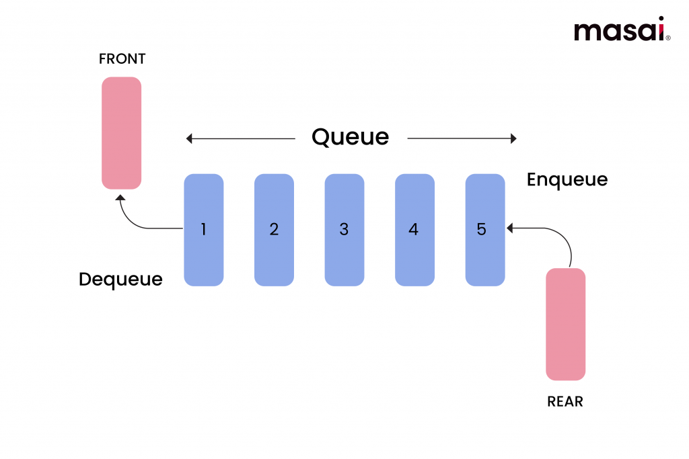

# Queue

The **Queue** library provides a generic **FIFO (First In, First Out)** queue data structure for Go.

## Overview

A Queue is a data structure that follows the **FIFO** principle (First In, First Out):
the element added first will be removed first.



## Installation

```bash
go get github.com/imLeHuyHoang/queue
```

## Queue Methods

### `NewQueue[T any]() *Queue[T]`

Creates a new queue with a generic type.

```go
q := queue.NewQueue[int]()        // Queue of integers
q2 := queue.NewQueue[string]()    // Queue of strings
```

---

### `Enqueue(v T)`

Adds an element to the end (rear) of the queue.

```go
q := queue.NewQueue[int]()
q.Enqueue(10)  // Queue: [10]
q.Enqueue(20)  // Queue: [10, 20]
q.Enqueue(30)  // Queue: [10, 20, 30]
//    Front (first element) ^        ^ Rear (last element)
```

---

### `Dequeue() (v T, ok bool)`

Removes and returns the element at the front of the queue.

* Returns `ok = true` if the operation succeeds
* Returns `ok = false` if the queue is empty (value `v` will be the zero value of type `T`)

```go
v, ok := q.Dequeue()  // v = 10, ok = true, Queue: [20, 30]
if ok {
    fmt.Println(v)  // Output: 10
}

// When the queue is empty
empty := queue.NewQueue[int]()
v, ok := empty.Dequeue()  // v = 0 (zero value), ok = false
```

---

### `Front() (v T, ok bool)`

Returns the element at the front of the queue **without removing it**.

```go
v, ok := q.Front()  // v = 20, ok = true, Queue remains: [20, 30]
if ok {
    fmt.Println(v)  // Output: 20
}
```

---

### `Rear() (v T, ok bool)`

Returns the element at the rear of the queue **without removing it**.

```go
v, ok := q.Rear()  // v = 30, ok = true, Queue remains: [20, 30]
if ok {
    fmt.Println(v)  // Output: 30
}
```

---

### `Len() int`

Returns the number of elements in the queue.

```go
count := q.Len()  // count = 2
```

---

### `IsEmpty() bool`

Checks whether the queue is empty.

```go
if q.IsEmpty() {
    fmt.Println("Queue is empty")
} else {
    fmt.Println("Queue has", q.Len(), "elements")
}
```

---

### `Clear()`

Removes all elements from the queue.

```go
q.Clear()
fmt.Println(q.IsEmpty())  // true
```

---

### `ToSlice() []T`

Returns a slice containing all elements in the queue (from front to rear).

* The returned slice is a **copy**
* Modifying it will **not affect** the original queue

```go
q := queue.NewQueue[int]()
q.Enqueue(10)
q.Enqueue(20)
q.Enqueue(30)

slice := q.ToSlice()  // [10, 20, 30]
```

---

## Example

```go
package main

import (
	"fmt"
	"github.com/imLeHuyHoang/queue"
)

func main() {
	// Create a queue of strings
	q := queue.NewQueue[string]()

	// Check if the queue is empty
	fmt.Println("Queue is empty:", q.IsEmpty())  // true

	// Enqueue elements
	q.Enqueue("Alice")
	q.Enqueue("Bob")
	q.Enqueue("Charlie")
	fmt.Println("Number of people in queue:", q.Len())  // 3

	// Peek front element
	first, ok := q.Front()
	if ok {
		fmt.Println("First person:", first)  // Alice
	}

	// Peek rear element
	last, ok := q.Rear()
	if ok {
		fmt.Println("Last person:", last)  // Charlie
	}

	// Serve people in FIFO order
	fmt.Println("\nServing:")
	for !q.IsEmpty() {
		person, _ := q.Dequeue()
		fmt.Println("-", person)
	}
	// Output:
	// - Alice
	// - Bob
	// - Charlie

	// Try dequeue on an empty queue
	_, ok = q.Dequeue()
	if !ok {
		fmt.Println("\nQueue is empty")
	}
}
```


